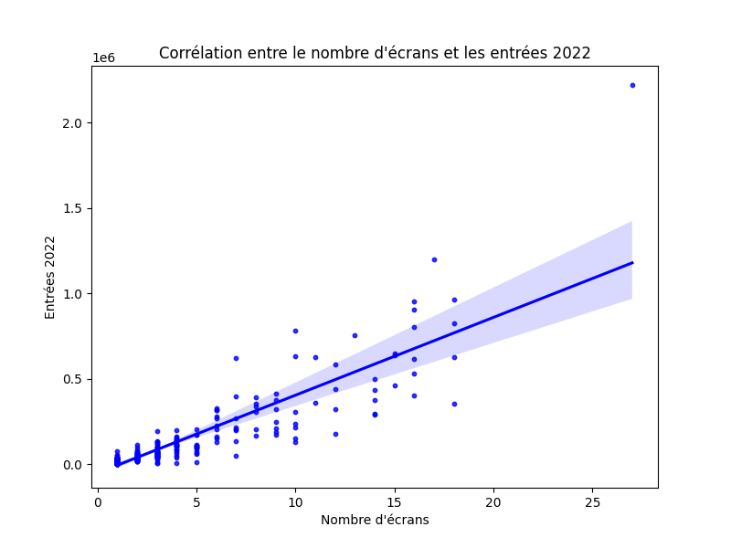
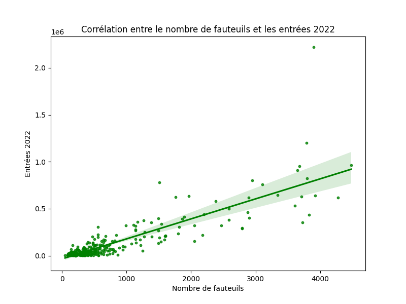

# Analyse des données des salles de cinéma

## Objectif
Ce projet vise à analyser les données des salles de cinéma en Île-de-France, en utilisant des techniques de nettoyage, d'exploration, et d'analyse de corrélation afin de mieux comprendre les facteurs influençant la fréquentation des salles.

---

## Étapes du projet

### **Exercice 1 : Nettoyage et exploration des données (5 pts)**

- **Nettoyage des données :**
  - Les valeurs manquantes ont été identifiées :
    - La colonne `entrées 2021` contenait des valeurs manquantes, elles ont été remplacées par la moyenne pour conserver une cohérence des données.
  - Le nettoyage a permis de rendre les données exploitables pour les étapes suivantes.

- **Exploration :**
  - Les premières lignes du dataset ont été affichées pour visualiser sa structure.
  - Des statistiques descriptives ont été générées pour les colonnes suivantes :
    - **Nombre d’écrans**
    - **Nombre de fauteuils**
    - **Entrées annuelles (2022)**

---

### **Exercice 2 : Analyse des données (4 pts)**

- **Calcul des entrées moyennes par fauteuil** pour chaque région.
- **Identification des meilleures et pires régions :**
  - Les 3 régions avec les meilleurs résultats en termes d’entrées moyennes par fauteuil.
  - Les 3 régions avec les pires résultats.
- **Visualisation :**
  - Un **graphique à barres** a été créé pour représenter les entrées moyennes par fauteuil dans les 10 régions.

---

### **Exercice 3 : Corrélations entre infrastructures et fréquentation (4 pts)**

#### Calcul et affichage des corrélations :
1. **Corrélation entre le nombre d’écrans et les entrées annuelles :**  
   - Coefficient de corrélation : `0.8797`
2. **Corrélation entre le nombre de fauteuils et les entrées annuelles :**  
   - Coefficient de corrélation : `0.8445`

#### Visualisations :
- **Nuages de points avec régressions linéaires :**
  - **Graphique 1 :** Corrélation entre le nombre d’écrans et les entrées annuelles.  
    
  - **Graphique 2 :** Corrélation entre le nombre de fauteuils et les entrées annuelles.  
    

#### Conclusion :  
Le **nombre d’écrans** a un impact légèrement plus important sur les entrées annuelles que le **nombre de fauteuils**, comme l’indiquent les coefficients de corrélation. Les visualisations confirment cette tendance, avec une régression linéaire plus marquée pour le nombre d’écrans.

---

## Comment exécuter les scripts ?

1. **Cloner ce dépôt :**
   ```bash
   git clone <URL_du_dépôt>
   cd CinemaDataAnalysis

### Exercice 4 : Modèle prédictif des entrées annuelles (5 pts)
- **Traitement des données :**
  - Ajout d'une colonne `année` au dataset si elle n'était pas présente.
  - Remplacement des valeurs manquantes dans `entrées 2021` par la moyenne.
- **Modèle entraîné :**
  - Régression linéaire avec les variables explicatives : `écrans`, `fauteuils`, et `population de la commune`.
- **Performances :**
  - Erreur moyenne absolue (MAE) - Entraînement : 34,165.79
  - Erreur moyenne absolue (MAE) - Test : 36,544.95
  - Coefficient de détermination (R²) - Test : 0.78


